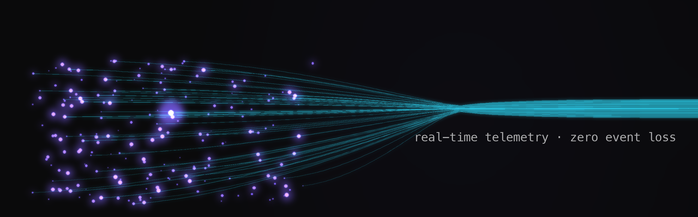

# Hassan Raza

**Senior Software Engineer — Backend & Distributed Systems** · Dubai, UAE · He/Him

I build real-time backend systems that stay correct under load — telemetry pipelines, event-driven services, and the data models and APIs on top of them.

- **Led the delivery that onboarded Saudi Aramco** at [Tenderd](https://tenderd.com) (YC S18) — an equipment-booking module built from scratch and shipped in under two months with a 7-engineer team; Aramco manages ~200 pieces of equipment through it.
- **Migrated a live IoT telemetry pipeline (CDC → Kafka) to a new schema with zero event loss** — and fixed the uncommitted-offset and poison-message bugs that stalled consumers along the way.
- **Scaled event-driven services for 5M+ users** at Bykea — RabbitMQ → Kafka event sourcing, trip-state event logs feeding fraud detection, ~50% cache-load reduction.

**Stack:** TypeScript / Node.js · Go · Python · Kafka · PostgreSQL · MongoDB · Redis · AWS · MQTT · NestJS

### Find me

- 🌐 Portfolio & case studies: [hassanrazanini.com](https://hassanrazanini.com)
- 💼 LinkedIn: [linkedin.com/in/hassan-memon](https://www.linkedin.com/in/hassan-memon/)
- 📄 CV: [hassanrazanini.com/Hassan_Raza_CV.pdf](https://hassanrazanini.com/Hassan_Raza_CV.pdf)
- ✉️ hassanrazamohammadtufail@gmail.com

> Most of my production work lives in private/client repositories — the portfolio's case studies document the architecture and trade-offs in detail.
